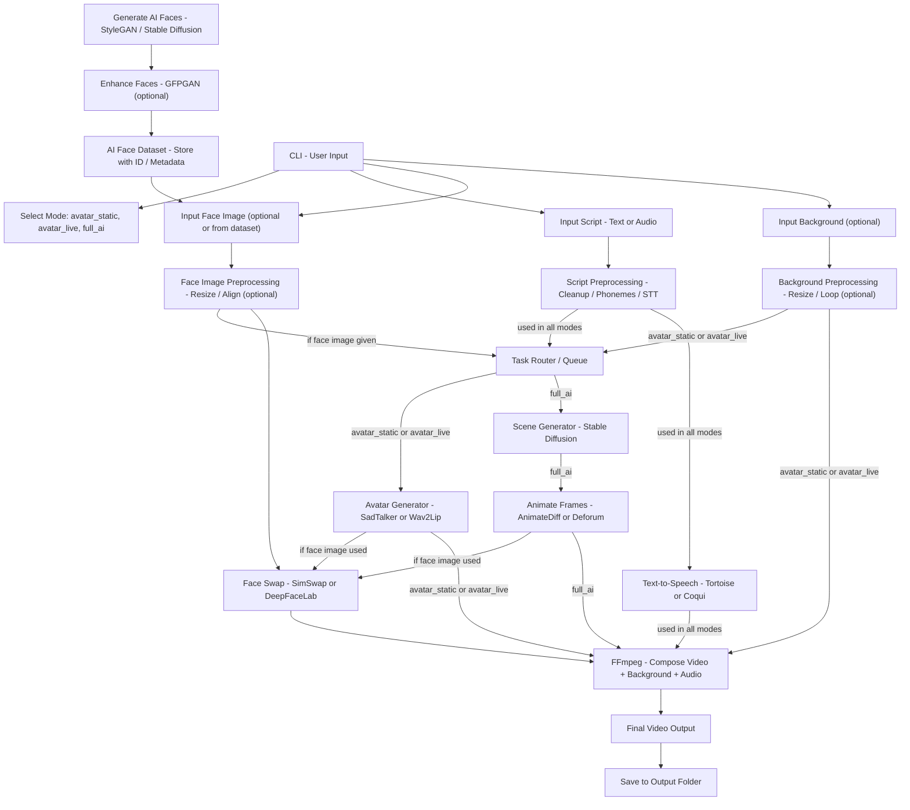

# 🧠 LifeLike

A Python-based command-line tool to generate AI-powered videos using synthetic avatars, static or animated backgrounds, and text/audio scripts — with zero dependency on real human input.

This project is designed to serve as the backend core for a future platform or vlogging automation system using open-source AI models.

---

## 📌 Features

- Use **AI-generated faces** as avatars (no real people)
- Generate videos from **text or audio scripts**
- Support for:
  - Talking head avatars (`avatar_static`)
  - Animated avatars (`avatar_live`)
  - Fully generated scenes (`full_ai`)
- Face swapping using synthetic faces
- TTS using open-source models like Coqui or Tortoise
- Backgrounds: still images, slight motion (GIF/loop), or AI-generated scenes
- FFmpeg-based video composition

---

## 🧱 System Design (Process Flow)


## 🔄 Mode Breakdown

| Mode            | Avatar Source   | Background      | Animation           | Example Use Case              |
| --------------- | --------------- | --------------- | ------------------- | ----------------------------- |
| `avatar_static` | AI face         | Still image     | Minimal (SadTalker) | Scripted vlog or monologue    |
| `avatar_live`   | AI face         | AI scene/static | Lip sync / pose     | Talking character in scenery  |
| `full_ai`       | Prompt-to-scene | AI generated    | Fully animated      | Storytelling, creative videos |

## 🧰 Tech Stack

| Component             | Tools / Models                      |
| --------------------- | ----------------------------------- |
| Face Generation       | StyleGAN3, GFPGAN, Stable Diffusion |
| Script Preprocessing  | TTS Tokenizer, Whisper (STT)        |
| Avatar Generation     | SadTalker, Wav2Lip                  |
| Scene Generation      | Stable Diffusion + AnimateDiff      |
| Face Swap             | SimSwap, DeepFaceLab                |
| TTS                   | Tortoise TTS, Coqui                 |
| Video Composition     | FFmpeg                              |
| Task Queue (optional) | Celery + Redis                      |

🗃 Directory Structure
```bash
ai_avatar_cli/
│
├── main.py                  # CLI entrypoint
├── dataset/
│   └── ai_faces/            # Pre-generated AI face images
├── scripts/
│   └── enhancer.py          # GFPGAN enhancer
│   └── generate_faces.py    # StyleGAN/SD-based generation
│   └── swap.py              # Face swap logic
├── preprocess/
│   └── script.py            # Cleanup, phonemes, whisper STT
│   └── face.py              # Resize, alignment
├── generation/
│   └── avatar.py            # SadTalker/Wav2Lip
│   └── scene.py             # SD + AnimateDiff
├── tts/
│   └── tts_engine.py        # Tortoise or Coqui
├── compose/
│   └── ffmpeg_compose.py    # Video + Audio + BG merger
└── output/
    └── generated/           # Final video outputs
```
## 🏁 Getting Started

```bash
# Step 1: Generate AI faces (optional, can be done once)
python scripts/generate_faces.py --count 10 --out dataset/ai_faces

# Step 2: Run video generation in avatar_static mode
python main.py \
    --mode avatar_static \
    --face_id id_003 \
    --script "Welcome to my AI vlog!" \
    --background "assets/forest.jpg"
```