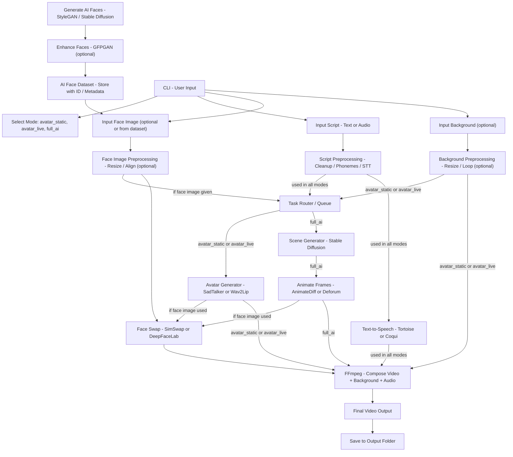

# 🧠 LifeLike

A Python-based command-line tool to generate AI-powered videos using synthetic avatars, static or animated backgrounds, and text/audio scripts — with zero dependency on real human input.

This project is designed to serve as the backend core for a future platform or vlogging automation system using open-source AI models.

---

## 📌 Features

- Generate highly consistent AI avatars and images using open-source models (Stable Diffusion XL, DreamBooth/LoRA)
- Fine-tune models for specific identities using DreamBooth/LoRA (with CLI automation)
- Batch image generation from prompt files or parameterized prompt combinations
- Per-image metadata saved as JSON (same name as image file)
- Face swapping, face/body focus, and advanced prompt-based workflows
- Support for high-resolution, studio-like, and diverse image generation
- Save random seed for each image for reproducibility
- (Optional) Generate small, balanced DreamBooth datasets
- (Optional) Zip output for easy download
- Robust CLI with error handling and user feedback

---

## 🚀 Quick Start: Clone to Running the CLI

### 1. Clone the Repository (with Submodules)
```bash
git clone --recurse-submodules <your-repo-url> lifelike
cd lifelike
```
If you already cloned without submodules:
```bash
git submodule update --init --recursive
```

### 2. Create and Activate a Virtual Environment
```bash
python -m venv .venv
.venv\Scripts\activate  # On Windows
# Or
source .venv/bin/activate  # On Linux/macOS
```

### 3. Install All Requirements (including local diffusers)
```bash
pip install -r requirements.txt
```

### 4. (Optional) Configure Accelerate for GPU
```bash
accelerate config
```
- Select your GPU (CUDA) device
- Set mixed precision to `no` if using SDXL LoRA DreamBooth

### 5. Prepare Your Dataset
- Place your training images in a folder, e.g.:
  ```
  dataset/faces/raghu/1.png
  dataset/faces/raghu/2.png
  ...
  ```

### 6. Run the CLI
- **Generate a base face/person (with all combinations):**
  ```bash
  python lifelike/app.py generate-person raghu [OPTIONS]
  ```
  - Generates a diverse set of images for a new identity by combining all specified prompt parameters (angles, moods, styles, poses, accessories, lighting, backgrounds, hair styles, etc.).
  - **Face-only vs. Full-body:**
    - By default, generates face-focused portraits (`--face-focus`).
    - Use `--include-full-body` to generate full-body images instead. If both are set, full-body takes priority.
  - **DreamBooth Set:**
    - Use `--dreambooth-set` to generate a small, balanced dataset (8-16 images) for DreamBooth/LoRA fine-tuning. This mode samples a variety of angles, moods, and backgrounds for best training results.
  - **Options:**
    - `--per-angle`: Images per unique combination (default: 5)
    - `--gender`, `--ethnicity`, `--age`, `--moods`, `--angles`, `--styles`, `--poses`, `--accessories`, `--lighting`, `--backgrounds`, `--hair-styles`: Control the diversity of generated images
    - `--max-photos`: Limit the total number of images
    - `--output-dir`: Output directory (default: output/generated_person)
    - `--zip-output`: Zip the output folder after generation
    - `--seed-base`: Set the random seed for reproducibility
    - `--expression-intensity`, `--camera-type`, `--resolution`: Further customize the output
  - **Output:**
    - Each image is saved as a PNG file, with a matching `.json` metadata file (same base name)
    - A `metadata.json` file summarizes all generated images
    - If `--zip-output` is set, the output folder is zipped for easy download

  **Examples:**
  ```bash
  # Generate 10 face-focused images for DreamBooth fine-tuning
  python lifelike/app.py generate-person raghu --dreambooth-set --per-angle 1 --max-photos 10

  # Generate 20 full-body images with diverse poses and backgrounds
  python lifelike/app.py generate-person raghu --include-full-body --max-photos 20 --poses "standing,sitting,arms crossed" --backgrounds "park,urban street"
  ```

- **Fine-tune (DreamBooth/LoRA):**
  ```bash
  python lifelike/app.py fine-tune-person raghu ./dataset/faces/raghu --steps 600 --prior_loss_weight 1.0
  ```

- **Generate variations (using fine-tuned model if available):**
  ```bash
  python lifelike/app.py generate-variations raghu --count 5
  ```

- **Generate a single image or batch from prompts:**
  ```bash
  python lifelike/app.py generate-image "A photorealistic portrait of a smiling Indian woman in a saree"
  # Or batch:
  python lifelike/app.py generate-image --prompt-file prompts.txt
  ```

---

## 📝 CLI Commands

- `generate-person` — Generate a diverse set of images for a new identity, with all prompt combinations and per-image metadata.
- `fine-tune-person` — Fine-tune a model for a specific person using DreamBooth/LoRA.
- `generate-variations` — Generate multiple high-quality images for a person (uses fine-tuned model if available).
- `generate-image` — Generate a single image from a prompt, or batch from a file (per-image metadata not yet implemented for batch).
- `version` — Show CLI version.

---

## 🧱 System Design (Process Flow)


## 🔄 Mode Breakdown

| Mode            | Avatar Source   | Background      | Animation           | Example Use Case              |
| --------------- | --------------- | --------------- | ------------------- | ----------------------------- |
| `avatar_static` | AI face         | Still image     | Minimal (SadTalker) | Scripted vlog or monologue    |
| `avatar_live`   | AI face         | AI scene/static | Lip sync / pose     | Talking character in scenery  |
| `full_ai`       | Prompt-to-scene | AI generated    | Fully animated      | Storytelling, creative videos |

## 🧰 Tech Stack

| Component             | Tools / Models                      |
| --------------------- | ----------------------------------- |
| Face Generation       | StyleGAN3, GFPGAN, Stable Diffusion |
| Script Preprocessing  | TTS Tokenizer, Whisper (STT)        |
| Avatar Generation     | SadTalker, Wav2Lip                  |
| Scene Generation      | Stable Diffusion + AnimateDiff      |
| Face Swap             | SimSwap, DeepFaceLab                |
| TTS                   | Tortoise TTS, Coqui                 |
| Video Composition     | FFmpeg                              |
| Task Queue (optional) | Celery + Redis                      |

🗃 Directory Structure
```bash
ai_avatar_cli/
│
├── main.py                  # CLI entrypoint
├── dataset/
│   └── ai_faces/            # Pre-generated AI face images
├── scripts/
│   └── enhancer.py          # GFPGAN enhancer
│   └── generate_faces.py    # StyleGAN/SD-based generation
│   └── swap.py              # Face swap logic
├── preprocess/
│   └── script.py            # Cleanup, phonemes, whisper STT
│   └── face.py              # Resize, alignment
├── generation/
│   └── avatar.py            # SadTalker/Wav2Lip
│   └── scene.py             # SD + AnimateDiff
├── tts/
│   └── tts_engine.py        # Tortoise or Coqui
├── compose/
│   └── ffmpeg_compose.py    # Video + Audio + BG merger
└── output/
    └── generated/           # Final video outputs
```
## 🏁 Getting Started

```bash
# Step 1: Generate AI faces (optional, can be done once)
python scripts/generate_faces.py --count 10 --out dataset/ai_faces

# Step 2: Run video generation in avatar_static mode
python main.py \
    --mode avatar_static \
    --face_id id_003 \
    --script "Welcome to my AI vlog!" \
    --background "assets/forest.jpg"
```